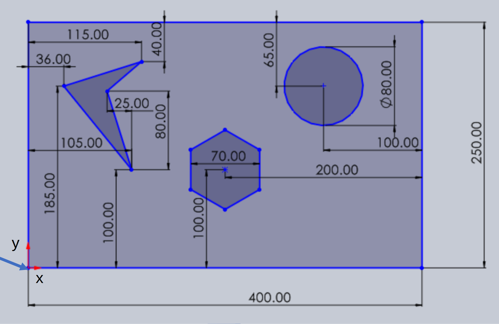

[](https://opensource.org/licenses/MIT)

Verified on Ubuntu 20.04 and python 3.8.10, packages used are heapq, cv2 and NumPy.<br>
all units are in mm.

# a-star-algorithm
Finding the optimal path from start node to goal node on a predefined map using A Star algorithm

<br>
**Map**


## To install the dependencies
```
sudo pip install numpy
sudo pip install opencv-python
```

## Steps to run
To clone the file:
```
git clone https://github.com/Rishabh96M/a-star-algorithm.git
cd a-star-algorithm
```

To run the code:
```
python main.py
```
This code will ask the user for radius of robot, clearance, step size, starting point and goal point on the map. After the path is found, It will animate all searched nodes and display the optimal path found using AStar algorithm <br>

This ***videos*** folder contains example video for: <br>
clearance: 5
radius: 10
step-size: 10
test1.mp4: start = (100, 180, 0) and goal = (130, 230, 0) <br>
test2.mp4: start = (40, 20, -180) and goal = (150, 100, 0)
